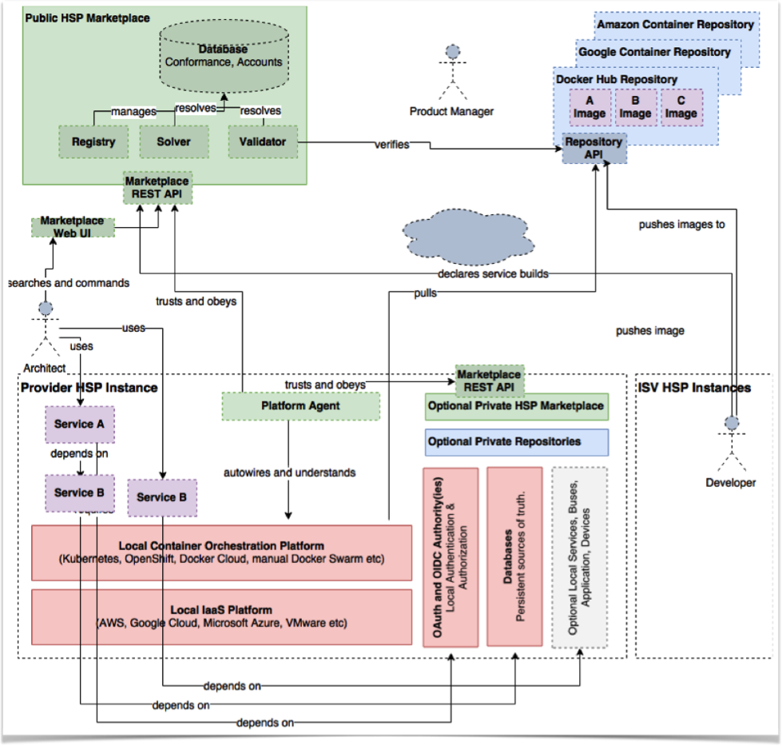
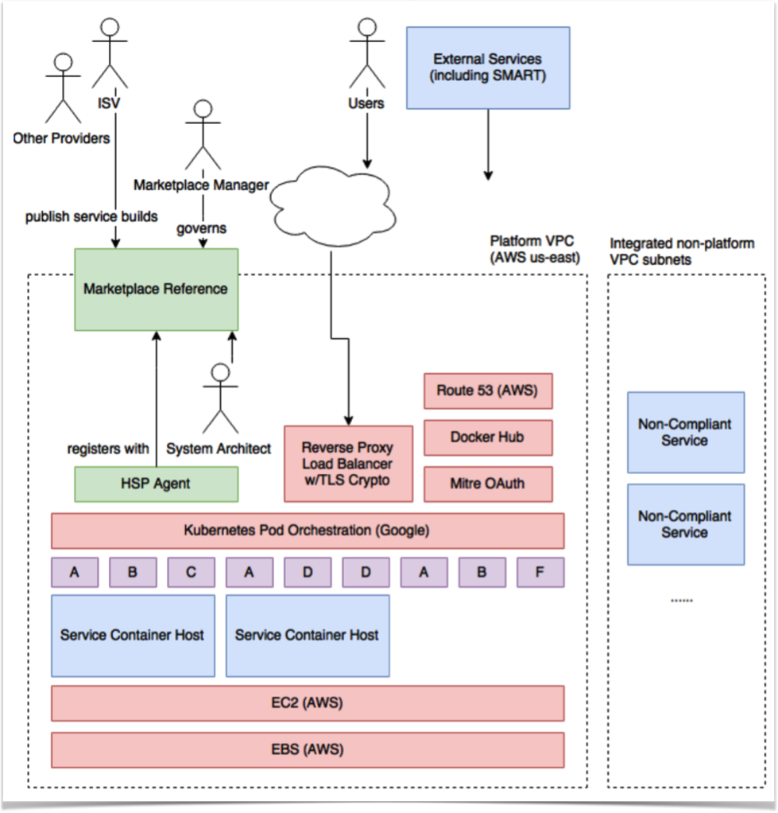

# Functional Infrastructural Model
The Marketplace specification aims to ease service deployment woes in an infrastructure-neutral manner, not complicate them, and acknowledges organizations tend to run services in a combination of:

* Locally-provisioned, co-located, and managed VMs using on-premise IaaS tools

* Bare metal machines and appliances for one-off use cases and legacy needs

* Cloud services such as Amazon Web Service, Microsoft Azure, and Google Cloud

To make automated health Product provisioning possible, all Products MUST meet a set of interoperability criteria prior to being published in the Marketplace that may be validated automatically. The Marketplace API, at the specification level, does not and should not make infrastructure mandates; however, to leverage HL7 Marketplace implementations to the greatest extent, a number of local Platform requirements SHOULD be met. A compatible Health Services Platform conceptually unifies three areas of an IT architecture:

* Packaging - How individual service builds are produced by independent software vendors (ISVs) and consumed by IT groups.

* Curation - Definition and announcement of a service build’s capabilities and dependencies.

* Orchestration - Automated service dependency resolution and deployment into the local IT architecture.

##What is a “Health Product”?

The name “Health Services Platform Marketplace” was chosen to imply that a formal definition of a service (“Product”) is the focal currency of an implementation. It is thus necessary to provide criteria for what does/does not constitute a Product in the Service Functional Model (SFM) prior to defining the Marketplace API.
Products are declared to the Marketplace via a client such as the reference web UI, other compatible application, or script. Each “Product” instance is primarily a metadata declaration of human-readable fields, and references 0..* Builds that in turn point to versioned, executable images. These Builds – or more accurately the remote images they point to – are the meat of what is programmatically bootstrapped into a Platform environment and MAY be subject to additional validation per policies defined by the Marketplace operator, and based on declared capabilities.

## Health Services SHOULD be:
* __SSO Aware__ using OpenID Connect and/or SAML 2.0. If a service requires user logins, it should be declared as needing an SSO IDP such that configuration can be provided at run-time.

* __Provisionable__ via IETF SCIM 2 API implementations for individual and batch user and group management. This is a computing standard supported by ActiveDirectory and other identity management systems for synchronization of User and Group records.

* __Profilable__ supporting traceability across the architecture independent of programming language, including tracking of user session context across services for comprehensive system benchmarking (e.g. OpenTracing).

* __Incorruptible__ in the event they are killed without notice.

* __Offline-friendly__ to environments where no Internet access is permitted, or is subject to quality of service disruptions.

## Health Services SHOULD NOT be:

* __Data payloads__ While nothing prevents using a Marketplace for data distribution, service build images are intended to be used for executable materials. (Consider this a guideline that MAY change in the future.) Large data files SHOULD NOT be bundled into software images. Rather, container initialization steps should be implemented that download requisite data or pull them from a configured database.

* __Hardware dependent__ This is software that requires specific physical daughter cards, dongles, GPUs, CPU serial numbers etc. Platforms have no assumed means of binding to hardware dependencies. Future extension to image metadata MAY need to make special considerations, however, for frameworks such as OpenCL that aggregate underlying GPU hardware into abstract interfaces. This is currently a matter for future consideration due to differing hardware “passthrough” approaches across environments.

## Health Products Build and Packaging

### Health Products builds and package must be:
1. __Containerized__ into a single, OCI-compatible image. Docker Community Edition has been used as the gold standard and runtime verification tool and is recommended, but is not required.

2. __Ephemeral__. All persistent data must be saved to an external database and declared as a service dependency, if needed.

3. __Injected with configuration__ All configuration information, including database connection URLs, secret keys, DNS names, base URLs etc MUST be read from runtime environment variables or autodetected according to Twelve Factor1 principles. ISVs therefore MUST NOT “bake in” files intended to be manually edited by a system administrator, as no such hand editing is guaranteed in a Platform environment. Configuration variable names MUST ONLY be formed from uppercase A-Z, 0-9 numeric, and underscore ‘_’ characters. Values are always strings. (Lowercase is not permitted due to some environments performing configuration resolution using case-insensitive DNS mechanisms.)

4. __Programmatically validates__ Products declaring standard-compliant capabilities MUST support a mode for exercising declared APIs via a "smoke test" suite that MAY be triggered via a Marketplace itself. Product submissions failing to pass smoke tests on declared capabilities SHOULD be automatically rejected by the operator. Further, ISVs, operators, validators, end users, etc. SHOULD be able to trigger the same smoke test suite if/when they so choose. Operators MAY provide such test harnesses at their discretion. ISV tests specific to a Product or version SHOULD always be run as an out-of-band activity prior to submission to a Marketplace. Marketplace operators MAY elect to charge ISVs for additional testing and validation procedures at the discretion of the operator.

5. __Horizontally scaled__ The number of existing containers SHALL be constrained by the Configuration profile submitted by the vendor, at the discretion of the target Platform within defined constraints.
 
6. __Dynamically scalable__ Instances are scaled up/down at any time within the limits of the declared Configuration Task minimum/maximum values. Note: For HTTP services, the use of sticky sessions MUST NOT be used, in favor of JWTs or similar lightweight, non-sticky tracking for session state data, when needed.

7. __Single entry process__ per Configuration profile Task. If a Product Build requires, for example, the image to be run once as a web service and again as a separate worker node, these alternate entry points should be declared as distinct Tasks within the default Configuration at publication time.

8. __Domain name (DNS) agnostic__ Domain name, SSL/TLS context, and locale-specific settings MUST NOT be hardcoded into a Product Build. Configuration is always either injected at runtime or determined automatically, as can be done with HTTP-based Products.

9. __Unencrypted__ HTTP Products MUST assume that transport encryption is handled at a separate layer. SSL/TLS and reverse proxy load balancing is the responsibility of a target Platform, not the Product Build.

10. __Compute constrained__ Images must define the maximum per-task RAM requirement at image publication time, and manage use of memory internally to prevent exceeding this boundary. Platforms MUST guarantee that these resources will be available, even if overprovisioning virtual environments, and MAY reactively kill Products violating declared constraints.

11. __x86-64__. 32-bit binaries are also allowed, but other CPU architectures are not currently supported.

12. __Self-bootstrapped__ Every image MUST be able to bootstrap itself into a functional, default state with zero human intervention. This is assumed at publication time and is used for service validation, local consumer evaluation testing, and for seeding production deployments. Products MUST therefore set up any database schema and perform forward migrations automatically without user intervention at deployment, but MAY operate in limited capacity until out-of-band configuration is performed. This is the intended means for activating proprietary licensing schemes.

13. __Stoppable__ at container shutdown time within 10 seconds.

14. __Good citizens__ executing in good faith that they do exactly what they say within the environment (e.g. disclosure of operations being performed, data being stored etc), and do not perform other operations that would not be reasonably expected by a Platform operator.

15. __Traceable__ Health via process monitoring internal to the container should support prevailing standards of practice for the applicable software language/framework in use.

16. __Logged__ Products MUST log to standard out/error, and MUST NOT be written to the file system. PHI/PII MAY be logged but SHOULD be toggle-able by the local administrator via injected configuration flags.
#
## What is a compatible “Platform”?
A Health Services Platform is any infrastructural fabric capable of running service containers packaged distributed according to Marketplace requirements and compatible with the Service Functional Model (SFM). Due to the close relationship between Marketplace functions and Platform capabilities they are two sides of the same coin, though there is no presumption of a “Platform API”. While a Platform MAY fully operate without any automated Marketplace integration, and vice versa, doing so limits the potential of automating deployment of knowledge-based (and traditional) services acquired from external parties.
A Platform specification is not a strict specification, per se, but a profile of how to use existing technologies in an interoperable way. This is necessary because enterprise IT environments already have strategic directions on how core virtualization infrastructure is managed, and a prescriptive enterprise architecture strictly prohibiting deviations would not make traction in existing real-world organizations.
###Capabilities

A Platform is fundamentally three things. A(n):
1. Cluster of servers capable of running arbitrary Product packages according to Marketplace specifications, at minimum.
2. Orchestration framework of some form for fine-grained management of running services after initial deployment.
3. Optional agent synchronizing state changes made by 0..N authorized Marketplaces with the target state of the orchestration controller software.

In the exemplar reference implementation discussed in Supplementary Reference Implementation, these capabilities are provided as follows:

1. A horizontal set of virtual machines running Ubuntu Linux with Docker Community Edition.
2. Out-of-the-box Docker Swarm with Rancher and Portainer.
3. A minimalistic proof-of-concept agent listening for changes to the Marketplace-managed target Platform state, capable of initializing new service instances when an event is sent to the local Agent via push notification.

_Note that these supplemental materials are NOT part of the specification and are provided for convenience and further information. An example of fictitious on-premise Platform implementation is illustrated in Figure 1, below._

###Example on-premise Platform environment

Note that while the reference implementation uses Docker, it intentionally refrains from using all proprietary functions. Real-world implementations should choose a mainstream management system if not already present.
For Platform environments implemented using cloud resources, Figure 2 illustrates an equally compatible architecture using market-leading Amazon Web Services.2

###Cloud-based Platform implementation using Amazon Web Services.

