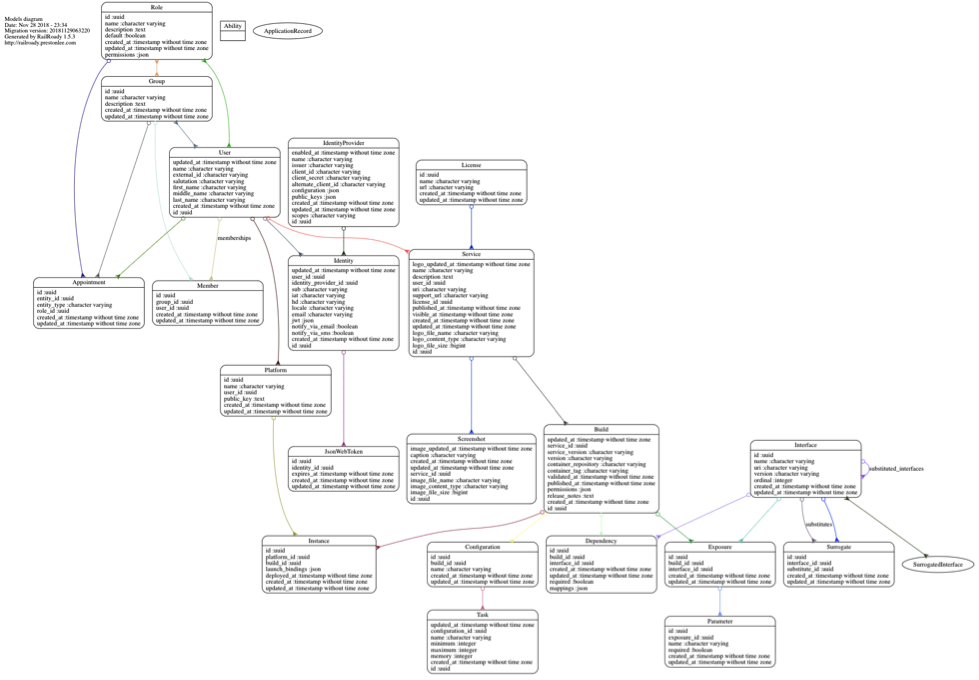

#Reference Implementation

In drafting this specification, several reference implemention projects were created as a means of vetting core use cases and modeling decisions. None of these projects should be considered part of the specification proper, but are useful in evaluation and planning. All projects discussed in this section have been made available under unencumbered F/OSS license and may be forked with or without explicit permission. They are subject to change without notice and are expected to do so from ongoing feedback.
1.17 Marketplace Service
The conceptual demonstration of the API implementation defined in the API section, including a basic bi-directional WebSocket mechanism for Agent automation, is available under Open Source license, here: https://github.com/preston/hsp-marketplace-server . At time of this writing a demo environment is available by request from HSPC.
The reference implementation provides platform-specific model (PSM) for PostgreSQL illustrated in Figure 7 Reference Marketplace Service Platform-Specific Model, and itself is built to be distributable as a Health Service by an instance of itself. The demo further demonstrates the principle of self-bootstrapping an underlying, external database into the correct state without human intervention, and implements 12-Factor configuration injection and other principles required of all Health Services.

The reference implementation further provides an integrated WebSockets-based pub/sub mechanism at the /websockets endpoint, implemented using the space_elevator library (https://github.com/preston/space_elevator) to receive Platform-instance-specific messages over a stateful Marketplace server connection. This demonstrates support for the automated point-and-click deployments ultimately envisioned.
1.18 Marketplace UI
While the Marketplace API does not define or assume any GUI capabilities, it is often easier to illustrate the capabilities of the Marketplace’s functional model with a breathing, interactive example.
The reference Marketplace UI is a web application written to the Marketplace API, using modern web technologies and in mainstream development style. It authenticates using OAuth 2 and OpenID Connect in the same manner as SMART-on-FHIR, and shows how frontend-only web applications may be easily containerized to meet Build Packaging requirements. Like the reference Marketplace Service, it is also packaged to be distributed by a Marketplace instance. Source code is available, here:
https://github.com/hspc/hsp-marketplace-server
https://github.com/hspc/hsp-marketplace-ui
A demo environment is available at HSPC by request.
1.19 Platform Agent
Health Platform Agents are largely outside the scope of this specification, but demonstration of how integration with a Marketplace instance connects with local container management is nevertheless useful. Limited example code showing connection and consumption of WebSocket events against the reference Marketplace Service is available at: https://github.com/hspc/hsp-agent.
